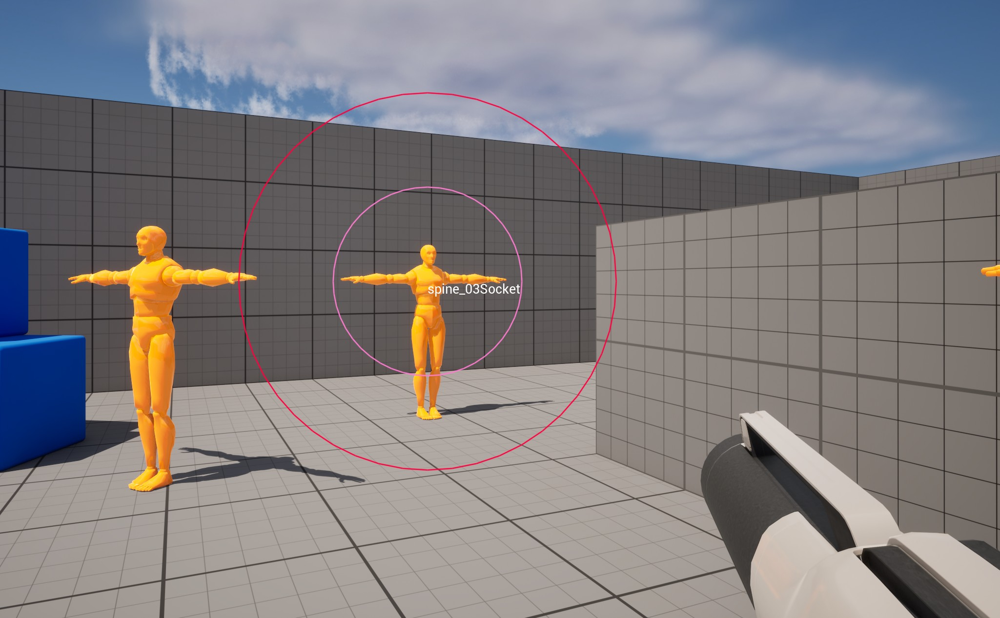
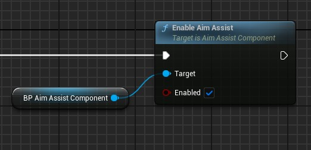
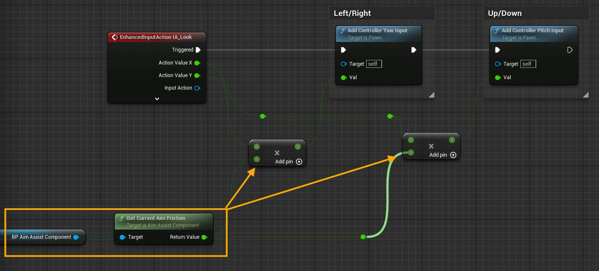
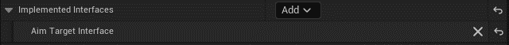
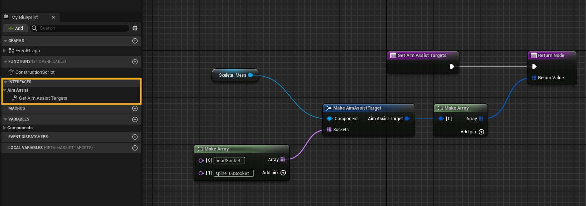
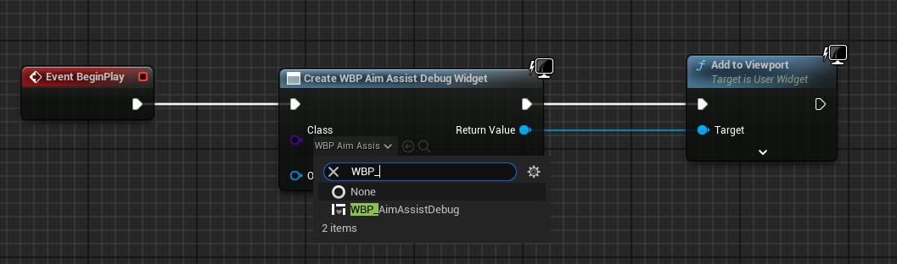

# Aim Assist Plugin

Aim assist plugin for unreal engine, containing actor component for ease of use.  

  

## Features

- Aim Assist component with togglable stickiness and magnetism helpers.  
- Target interface to get the potential aim points for component to lock onto.  
- Debug widget.  
- Team identity component to set up teams.  

### Friction

Friction feature slows down the sensitivity of camera look and turn when the target actor intersects with the radius on screen, this allows players to aim accurately.  

### Magnetism

Magnetism feature auto corrects the aim to face the center target. It smoothly interpolates the player view.  

## Setup

A few things are needed to get the system up and running:  

### Aim Assist Component Setup

1. Attach the "BP_AimAssistComponent" to your player controller.  
2. In your player controller get the aim assist component and enable the aim assist using this node:  

  

3. It is best to cache your aim assist reference in your character blueprint as well, in case you are handleing input there.  
4. To use the friction feature you will need to multiply the output value from aim assist's "Get Current Aim Friction" to your Yaw and Pitch Inputs:  

  

### Target Interface Setup

Refer to the "BP_DummyTarget" provided with plugin to see how to setup targets.  

To get the target locations from potential enemy you need to implement an interface to your target actor.  

  

- Here is how to implement the function:  

  

### Collision Setup

This depends on what type of query object list you have in your Aim Assist component by default the component will scan for pawns, world dynamic objects.  

If the actor implements an interface and has valid sockets the component will then perform the screen check, if that is a success at last the system does a visiblity check.  
For the visiblity check it is important that your mesh "blocks" the visiblity trace otherwise nothing will be detected.  

## Show Debug Information

For debug circles to show up, you need to add the provided "WBP_AimAssistDebug" to your viewport.  

  

Now in your "BP_AimAssistComponent" tick the Show Debug option.  